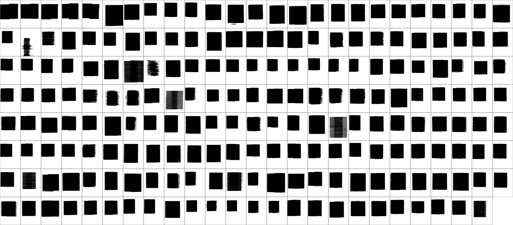
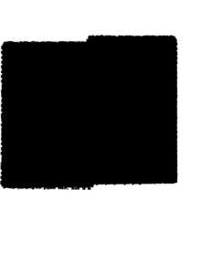
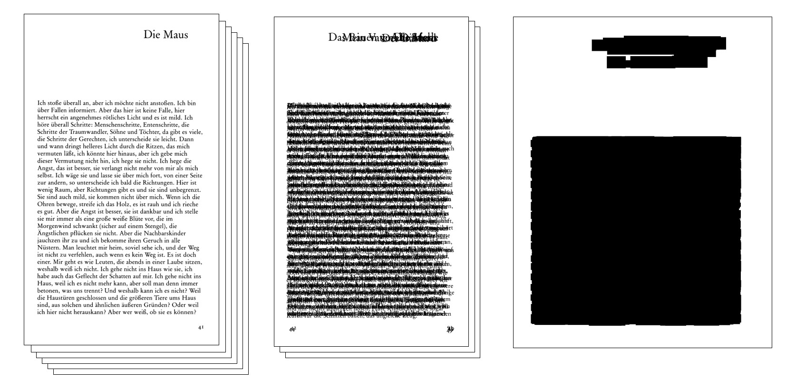
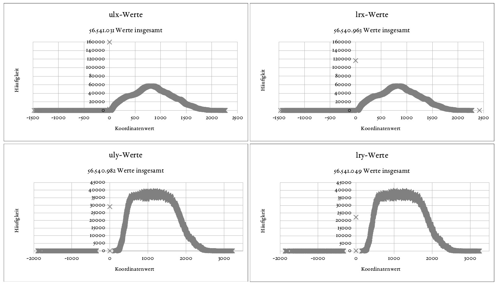

# hyperfast reading

Montage
| -------------- |
||

The insight-oriented, methodological project **hyperfast reading** appropriates a method called *distant viewing* from the fields of *picture- and film-analysis* (which itself is an appropriation of *distant reading* from the fields of *literary studies*) for the analysis of typographic page layouts. The insight, this project is looking for, is the layout of text-sources (although this can be any source of text that is visible visually, the project's concrete interest is oriented towards printed texts). While text-layouts are usually explained in abstract ways (sketch-lines and so forth abstract from the concrete phenomena), this approache tries to stay concrete and at the same time visualizes the concept of the layout. As this project is situated in an other project, which quarrels with Otl Aichers design of Ilse Aichingers books (S.Fischer: 1965 ff.), but cannot take those books into account because of copyrights, data from the [Deutsches Textarchiv](https://github.com/deutschestextarchiv) is taken.

## Seitenspiegel-Analyse am DTA OCR Korpus

> "Wo? Hier? Da? Wo sind die Wörter auf einer Buchseite?" (Derrida, Jacques: "Asche und Feuer", Brinkmann & Bose: Berlin 1988, S. 23)

Wer im stehenden Zug sitzt und aus dem Fenster die benachbarten Schienen beobachtet wird gewisse Details sehen, die verschwinden, wenn der Zug schneller wird. Ab einer bestimmten Geschwindigkeit sind die vielen kleinen Steine, die Schrauben und Kabel nicht mehr sichtbar und plötzlich treten die rostigen Schienen und vor allem ihre Form klarer in den Blick als zuvor. Ein ähnlicher Wahrnehmungs-Effekt kann auch bei unterschiedlichen Lesegeschwindigkeiten eines Buches beobachtet werden. Während das *Daumenkino* eine optische Täuschung ausnutzt, die durch *Differenz* entsteht, kommt beim *hyperschnellen Lesen* die *Homogenität* in den Blick. Diese soll nicht als Gegenteil von *close reading* verstanden werden, sondern dieses in gewisser Weise unterstützen indem es sein Augenmerk auf Relationen zwischen Buchgestaltung und Lesetext zu legen helfen versucht.

<iframe width="560" height="315" src="https://www.youtube.com/embed/5MEQ845JRUQ" frameborder="0" allow="accelerometer; autoplay; clipboard-write; encrypted-media; gyroscope; picture-in-picture"></iframe>

Der Begriff des *hyperschnellen Lesens* (*hyperfast reading*) versteht sich durchaus in der Folge des (als meta-methodologisch verstandenen) *distant reading*, unterscheidet sich (a) vom *distant viewing* durch seinen Fokus auf das Schriftbild, statt dem Bild und unterscheidet sich (b) vom *superimposition plot*, bei dem es sich garnicht um eine *Übereinanderlagerung* handelt, sondern um eine errechnete Abstraktion von Datapoints und dadurch eben jene Abstraktion vom konkreten Material durchführt, die im *hyperschnellen Lesen* eben umgangen werden soll. Die Methode soll "hyperschnell" genannt werden um es von einer 'Lesetechnik' zu unterscheiden, die sich zwar "schnelles Lesen" nennt, dabei aber Lesen im Sinn der Lektüre vermeiden möchte. Dem gegenüber soll es sich hier eben bloß um *einen Schritt in einer vielgestaltigen Lektüre* handeln, die *sowohl close als auch distant*, *sowohl surface als auch deep reading* ausprobiert und doch auch (wegen seiner festgestellten Brennweite) kein *scalable reading* ist.

Ziel des vorliegenden Projekts ist der Versuch einer nicht-metaphysischen Konzeptualisierung von Text-Layouts indem der konkrete, singuläre Text zur Ansicht gebracht und zugleich ein Blick auf das Gemeinsame des (mal mehr, mal weniger) pluralen Text zu erlauben. Im Spezifischen geht es hier aber um den Satzspiegel: *Wohin wurden auf einer Buchseite die Buchstaben gedruckt?* Obwohl das primäre Interesse der Buchgestaltung von Otl Aicher der Bücher von Ilse Aichinger gewidmet ist (S.Fischer: 1965 ff.: und den semantisierbaren Korrespondenzen zwischen Textinhalt, -performanz und -form), das aber aus urheberrechtlichen Gründen hier nicht in Betracht kommen kann, werden Daten vom [DTA-Kernkorpus](https://deutschestextarchiv.de) verwendet. Genauer: die XML-Daten aus dem OCR-Workflow der ersten Projektphase des DTA (2007–2010), die mit OCR erfasst, nachkorrigiert und in TEI P5 kodiert wurden. Es handelt sich um 199 Texte des *Kernkorpus*. Da das DTA seinen "Fokus", wie das Projektteam schreibt, auf die "Textdaten" legen möchte ("und die Verknüpfung zu den Faksimiledaten über die Seitenzuordnung ausreichend ist"), wurde dieser arbeitsaufwändige Workflow nicht mehr weiter geführt. Die entsprechenden Daten werden auf deren [Website](https://deutschestextarchiv.de/download#ocr) zur Verfügung gestellt. Die von mir am 30.1.2020 heruntergeladenen Daten datieren auf den 6.11.2013.

In den TEI-Daten des DTA werden jedem Buchstaben konkrete Koordinate nach folgendem Schema zugewiesen:

```xml
	<pb facs="#f0001"/>
	[…]
	<c ulx="44" uly="954" lrx="103" lry="1030" rendition="#c #b" xml:id="c1">R</c>
	<c ulx="102" uly="974" lrx="139" lry="1030" rendition="#c #b" xml:id="c2">u</c>
    <lb/>
	[…]
```

Ausgezeichnet sind in diesen Daten die TEI-*front*-, -*body*- und -*back*-Umgebungen (hier kommt nur der *body* in den Blick) und *framework*-Bereiche, das heißt beispielsweise Seitenzahlen, die hier nicht berücksichtigt werden.

Nota bene: Die Koordinaten beziehen sich weder auf die online dargestellten Faksimiles noch auf die Bilddaten der jeweiligen Urheber-Institution.

Animation
| ------------------------- |
||

## To do's

Das Skript hier stellt nur einen ersten Schritt dar um die Methode einem ersten Versuch zu unterziehen. Zu entwickeln bleibt dabei noch u.a. (1.) an welche andere, ähnliche bereits entwickelt Methoden angeschlossen werden kann (beispielsweise im Bereich der Kodikologie von Swati Chandna et al.: "[Quantitative Exploration of Large Medieval Manuscripts Data for the Codicological Research](http://doi.org/10.1109/ldav.2016.7874306)", danke Hannah Busch für den Hinweis!); (2.) eine Verbesserung der Datengrundlage (denn die DTA-Bilddaten sind nicht offen zugänglich und so können die Ergebnisse nicht zufriedenstellend mit abgeglichen werden); (3.) eine Auflösung der einseitigen Bilder in eine **Doppelseiten-Ansicht**, wie es für typographische Analysen notwendig wäre; (4.) nicht schwarze, sondern **semi-transparente Blöcke** übereinander legen wodurch häufiger bedruckte Stellen schwärzer ercheinen als seltener bedruckte (das würde auch auf den Hinweis von Frederike Neuber reagieren, dass bestimmte Layouts in einer überlagernden Darstellung nicht sichtbar werden) und die Anzahl der Seiten würde dadurch kenntlicher werden; …


## Erläuterung

Mit diesem Prozedere werden im Grunde die (bereits als verfügbar angenommenen) OCR-Koordinaten genommen und übereinander gelegt, wie im folgenden Bild von links nach rechts lesend dargestellt sein soll:



Das ergibt bei den DTA-OCR-Workflow-Daten folgende grobe Auswertung (per `grep`): Viele Werte liegen in unrealisitisch zu niedrigen (negativen) oder in zu hohen Bereichen, die im Skript auch nicht berücksichtigt werden.



